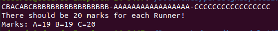

# SharedTable

*1
  *no exemplo nomeado como sharedTable, a race condition ocorre de modo queo resultado gerado édiferente do esperado, isso ocorre porque no método addMark, os valores são inseridos de modo paralelo, o que causa uma inconsistência de dados, fazendo com que alguma parte deles, seja perdida, por exemplo, o programa pode estar tentando inserir A e B ao mesmo tempo, mas apenas um dos valores vai ser inserido, pra solucionar isso usamos a palavra reservada synchronized, para que naquele método quando ocorrer isso, apenas um insira por vez, evitando o conflito
  
  
